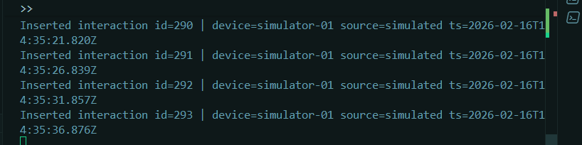

# 🧠 Sprint 3 --- Totem Inteligente Inclusivo

## Integração Profissional: Sensores → Banco → ML → Dashboard → Report → Orquestração

Repositório geral: https://github.com/matheus-meissner/inclusive_culture_totem  
Vídeo da Sprint 2: https://youtu.be/YS9H5aj9bus


**Última atualização:** 2026-02-16 15:25:35 UTC

------------------------------------------------------------------------

# 📌 1. Objetivo da Sprint 3

Consolidar pelo menos **60% dos módulos do sistema** em um fluxo
funcional integrado, garantindo:

-   Coleta de dados simulados (sensor)
-   Persistência estruturada (SQLite)
-   Treinamento de Machine Learning supervisionado
-   Geração de métricas e artifacts
-   Inferência com gravação de previsões
-   Dashboard interativo (Streamlit)
-   Relatório automático em Markdown
-   Orquestração completa via 1 comando

------------------------------------------------------------------------

# 🚀 2. Execução Rápida (Modo Avaliador)

Dentro da pasta `sprint3/`:

``` bash
python main.py all --seconds 60
```

Esse comando executa:

-   init-db
-   ingest
-   train
-   predict
-   report

### 📸 Evidência do pipeline completo

Arquivo esperado:

    

------------------------------------------------------------------------

# 🏗️ 3. Estrutura do Projeto (Sprint 3)

    sprint3/
    │
    ├── main.py
    ├── sensor/
    ├── database/
    ├── ml/
    │   └── artifacts/
    ├── reports/
    ├── dashboard/
    └── docs/prints/

------------------------------------------------------------------------

# 🟦 4. Simulação de Sensores

Arquivo:

    sensor/simulate_sensor.py

Geração contínua:

``` bash
python -m sensor.simulate_sensor
```

Geração em volume (bulk):

``` bash
python -m sensor.simulate_sensor --bulk 5000 --devices 5 --days 7
```

### 📸 Prints relacionados

    

------------------------------------------------------------------------

# 🟫 5. Banco de Dados (SQLite)

-   Tabela: `interactions`
-   Tabela: `predictions`
-   Integridade: UNIQUE(device_id, event_timestamp)

### 📸 Evidências

    

------------------------------------------------------------------------

# 🟧 6. Machine Learning (Supervisionado)

## Target

-   quick (≤5s)
-   normal (6--20s)
-   engaged (≥21s)

## Modelos

1.  DummyClassifier (baseline)
2.  RandomForest (FULL)
3.  RandomForest (sem duration_s --- sanity check)

## Métricas

-   Accuracy
-   F1-macro
-   Matriz de Confusão

### 📸 Prints ML

    

    

    


Artifacts gerados:

    ml/artifacts/model.pkl
    ml/artifacts/metrics.json
    ml/artifacts/confusion_matrix.png
    ml/artifacts/confusion_matrix_no_duration.png

------------------------------------------------------------------------

# 🟨 7. Inferência (Predictions)

Arquivo:

    ml/predict.py

Grava previsões no banco.

### 📸 Evidência

    

------------------------------------------------------------------------

# 🟦 8. Dashboard (Streamlit)

Rodar:

``` bash
streamlit run dashboard/app.py
```

## Abas:

-   Visão Geral
-   Machine Learning
-   Dados

### 📸 Prints Dashboard

    
    
    
    
    
    

------------------------------------------------------------------------

# 🧾 9. Report Automático

Gerado por:

``` bash
python -m reports.generate_report
```

Arquivo:

    reports/report.md

### 📸 Prints do Report

    
    
    
    

------------------------------------------------------------------------

# 🏁 10. Conclusão

A Sprint 3 consolida o Totem como um sistema completo, integrado e
validado:

-   Pipeline fim-a-fim funcional
-   ML com baseline + modelo principal + sanity check
-   Persistência estruturada
-   Dashboard interativo
-   Report automático
-   Orquestração profissional

Projeto pronto para documentação final e apresentação em vídeo.
